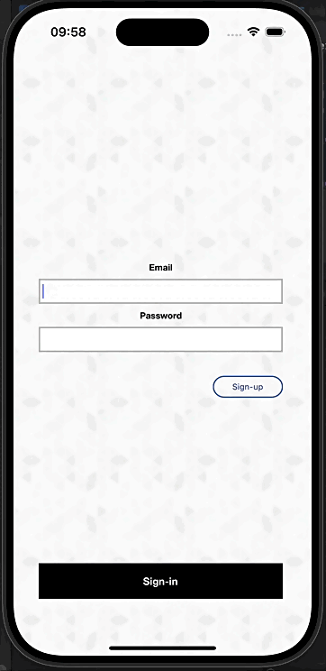
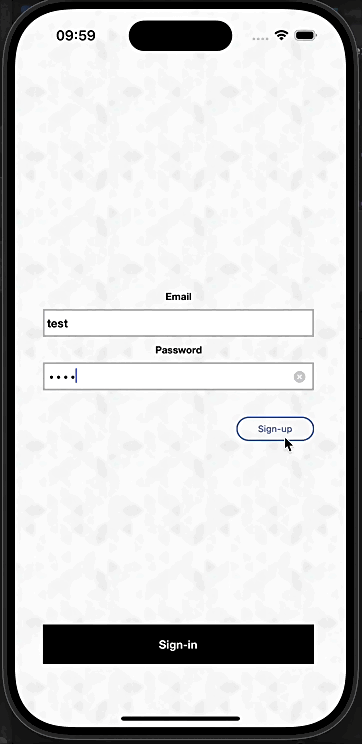

# Login Project - Objective-C

This project is a basic authentication (login) system developed in Objective-C, using the MVC (Model-View-Controller) architecture. It provides a simple implementation of login functionality in an iOS app, ensuring security and best practices.

## Requirements

Before starting, make sure you have the following requirements installed:

- **Xcode** (Version 16.0 or higher)
- **macOS** (Version 15 or higher)

## Technologies Used

- **Objective-C**: Main programming language for the project.
- **Swift 6**: Main programming language.
- **UIKit**: Standard library for building the graphical interface.
- **Xib and Storyboard**: Standard library for building the graphical interface.
- **XCTest, Unit and UI**: Used to do the tests.
- **NSURLSession**: Used to make project requests.
- **MVC (Model-View-Controller)**: Architectural pattern used in the project.
- **API public Generic**: https://jsonplaceholder.typicode.com/users

## Screens

<p align="center">
  
  
</p>

## Project Architecture

The project follows the **MVC (Model-View-Controller)** architecture, which is common in iOS development:

1. **Model**: 
   - Responsible for representing the data and business logic. In the context of login, the Model handles information like user credentials and validation.
   
2. **View**: 
   - Responsible for the graphical user interface. **Storyboards** and **xibs** are used to design the login screen and success/error messages.
   
3. **Controller**: 
   - Acts as an intermediary between the Model and the View. For login, the Controller captures user interactions, processes data, and updates the interface as needed.

## Features Implemented

- **Login with Email and Password**: Local credential validation and server integration.
- **Simple and Functional Interface**: Minimalistic design using UIKit.

## Folder Structure

```bash
LoginSampleApp
│
├── Controllers
│   ├── Login
│   │   └── LoginViewManager.h/.m  
│   └── SignUpView
│       └── SignUpViewManager.h/.m  
│
├── Models
│   ├── AddressModel.h/.m      
│   ├── CompanyModel.h/.m
│   ├── GeoModel.h/.m
│   └── UserModel.h/.m
│
├── Resources
│   ├── LaunchScreen.storyboard
│   └── Main.storyboard
│
├── Views
│   ├── Login
│   │   └── LoginViewController.h/.m  
│   └── SignUpView
│       └── SignUpViewController.swift       
│       └── SignUpViewController.xib      
│
```

## Installation

### 1. Clone the Repository

```bash
git clone https://github.com/jovitorneves/Objective-C-LoginSampleApp.git
```

### 2. Open the Project in Xcode

Navigate to the directory where you cloned the project and open the `.xcodeproj` file in Xcode.

```bash
cd Objective-C-LoginSampleApp
open LoginSampleApp.xcodeproj
```

### 3. Run in Simulator or Device

In Xcode, select the target (simulator or physical device) and click the **Run** button (play icon) to build and run the application.

## Versioning

This project follows semantic versioning:

- **v1.0.0**: Initial release with basic login functionality.

## Contributions

Contributions are welcome! Feel free to open **issues** or **pull requests**.

### How to Contribute

1. Fork the project.
2. Create a new branch (`git checkout -b feature/new-feature`).
3. Commit your changes (`git commit -m 'Add new feature'`).
4. Push to the branch (`git push origin feature/new-feature`).
5. Open a **pull request**.

## License

This project is licensed under the MIT License. See the [LICENSE](LICENSE) file for details.